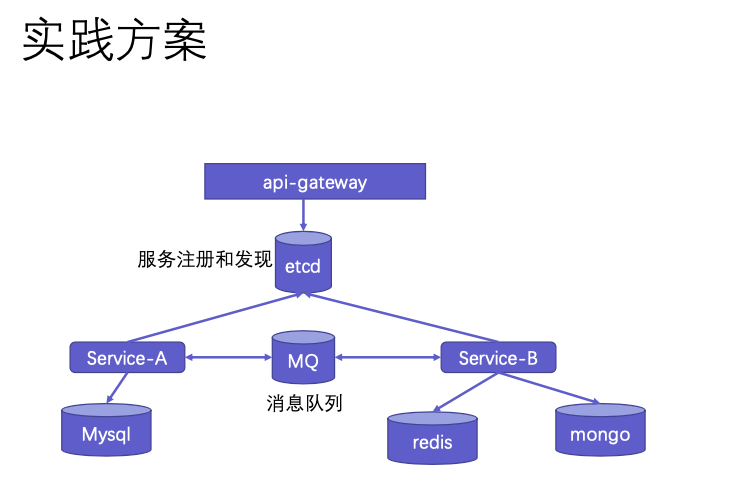
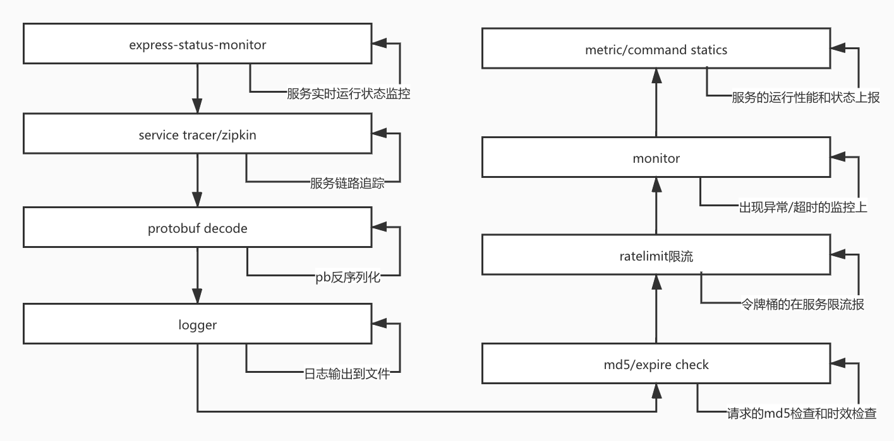
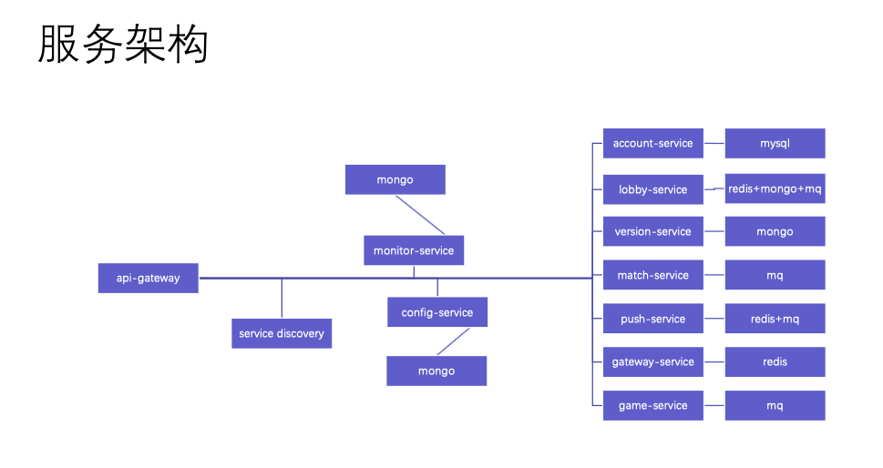

# micro
micro service framework in NodeJS

- web-service use [express](https://expressjs.com/)
- tcp-service use [pomelo](https://github.com/NetEase/pomelo/wiki/Home-in-Chinese)
- memory-cache use [redis](https://redis.io/)
- user data use [mongo](https://www.mongodb.com/)
- account or pay data use [mysql](https://www.mysql.com/)
- async communication between services use [RabbitMQ]()
- service register & discover use [etcd](http://rabbitmq.com/)
- config center also use [etcd](https://etcd.io/)
- service trace use [zipkin](https://zipkin.io/)
- service interface auth use [json-web-token](https://jwt.io/)
- service monitor: self develop
- rate limit use [express-rate-limit]()
- service safety use 
    - [protobuf](https://developers.google.com/protocol-buffers)
    - https
    - md5
    
## service-framework

## express-middlewares

## production practice

